# OBTENCIÓN DE LOS DATOS 📊🎮

¡Empecemos este emocionante proyecto sumergiéndonos en la obtención de datos! Desde la barra de herramientas, en la sección de inicio, seleccionamos nuestro valioso dataset llamado "ventas-videojuegos.xlsx". Con un clic cargamos los datos en Power BI. 
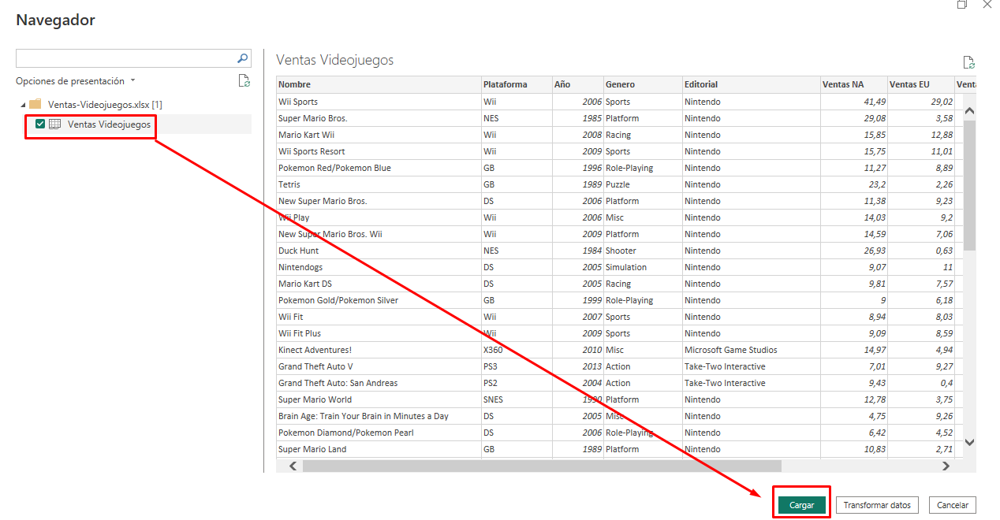

Observando el dataset vemos que tiene **16,326 filas** y **10 columnas** 

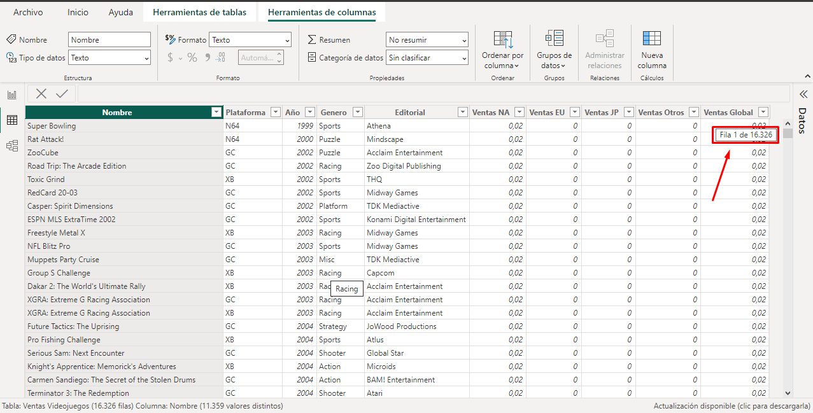 

Los campos son:
- **Nombre:** Muestra los nombres de los videojuegos
- **Plataforma:** Plataforma específica del videojuego.
- **Año:** El año en que se lanzó
- **Género**
- **Editorial**
- **Ventas NA:** para la región Norte América.
- **Ventas EU:** para la región de la Unión Europea
- **Ventas JP:** para Japón.
- **Ventas Otros**
- **Ventas Global:** corresponde a la suma de todas las ventas de regiones.

# PREPARACIÓN DE LOS DATOS 🛠️💡

Una vez cargados los datos en Power BI procederemos a prepararlos para los fines de este reporte. Para ello nos iremos al botón de transformar datos. 

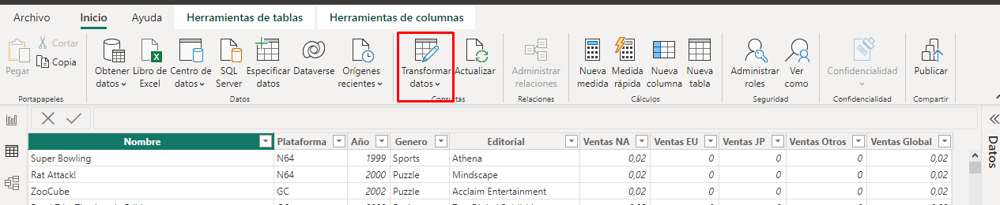 

Hacemos clic y esto nos llevará a una ventana que es el editor de consultas de Power Query. 

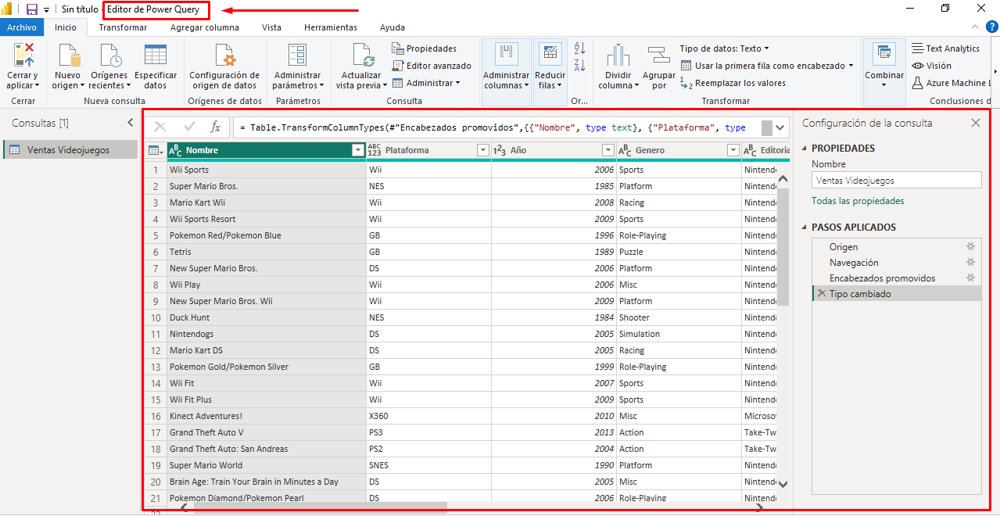

Desde aquí es donde vamos a hacer transformaciones y ajustes a nuestras tablas. Para esta tabla vamos a hacer algunos cambios que son requeridos para poder utilizar los datos apropiadamente en las visualizaciones.

En este caso, la columna o el campo **"Ventas Global"** no lo vamos a utilizar debido a que esta última estaría duplicando las ventas de las regiones. Hacemos clic derecho en el campo **"Ventas Global"** y le hacemos click en "Quitar" como se muestra la imagen.

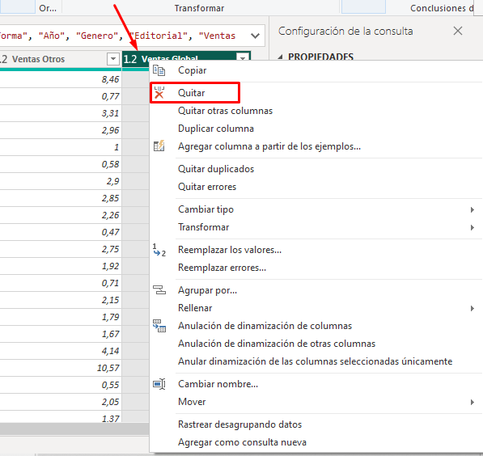

Observemos que hay varios campos de ventas para cada región. Aquí para poder trabajar apropiadamente en Power BI vamos a tener que hacer una normalización de estas columnas para que no haya redundancia.

Cuando estamos hablando de valores de ventas, lo más común es tener solamente una columna que represente a las ventas y otra columna que represente a las regiones. Esta es la mejor manera de trabajar con Power BI y otras plataformas para evitar redundancias.

Una forma sencilla de hacer esto es seleccionar las cuatro columnas y hacer **clic derecho**. Vamos a elegir la opción **"Anulación de dinamización de Columnas"** como muestra la figura. 

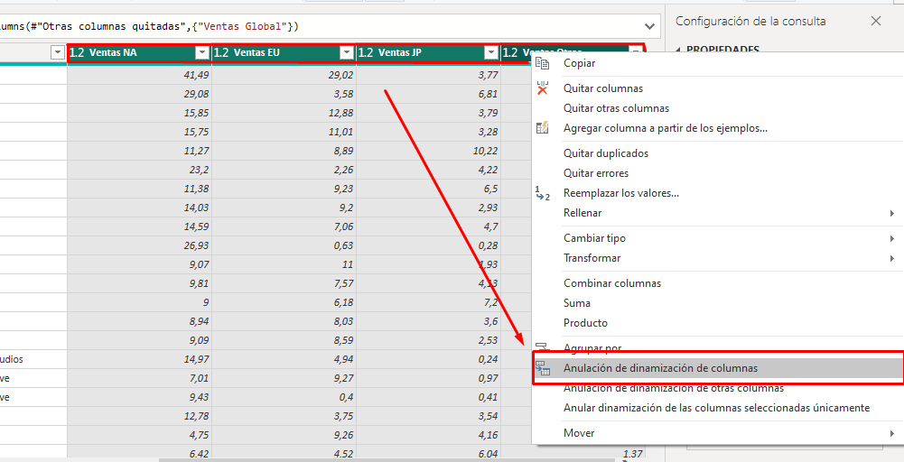

Nos queda de la siguiente forma: 

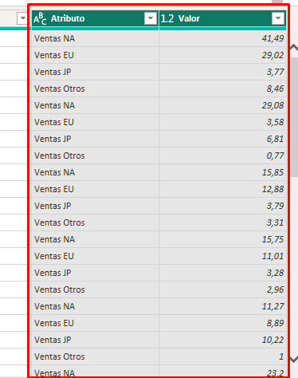

Ahora solo queda cambiar el nombre de la columna **"Atributo"** y le vamos a colocar el nombre de **"Región"** y la columna **"Valores"** vamos a renombrarlo con el nombre **"Ventas (millones)"**.

Una vez realizado esto vamos a cambiar los valores de la columna **"Regiones"** para normalizarlo. 

Es decir, para **"Ventas NA"** vamos a remplazarlo por **Norteamérica**, **"Ventas EU"** lo reemplazamos por **Europa**, para **"Ventas JP"** por **Japón** y para **"Ventas Otros"** por **Otros**.

Para hacerlo vamos a seleccionar la columna **"Región"**, hacemos clic derecho y elegimos la opción **"Reemplazar valores"** 
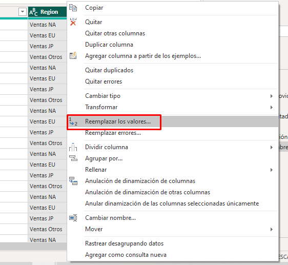 

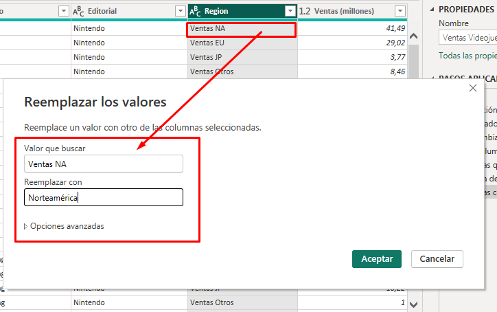 

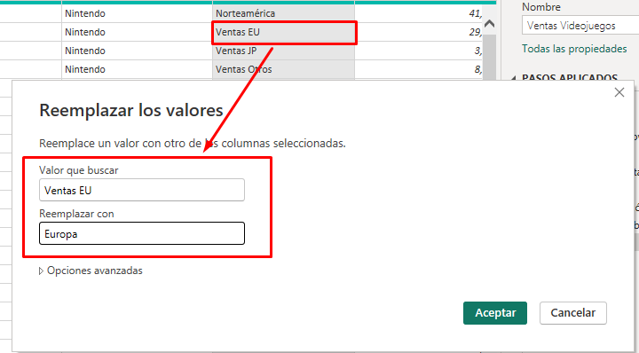 

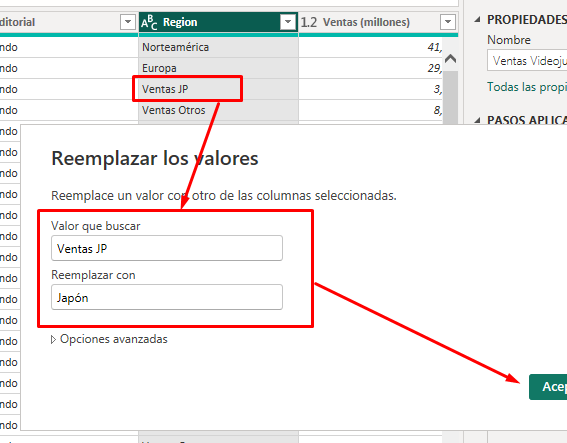 

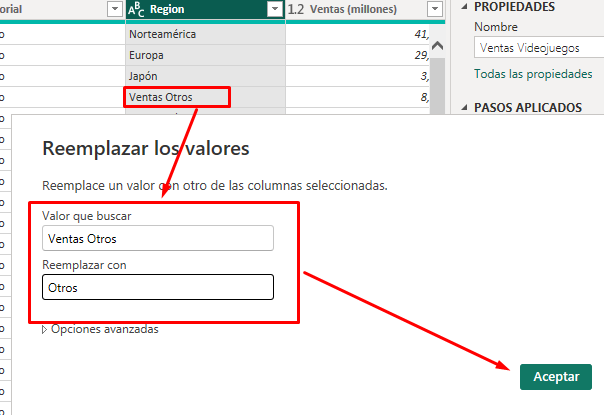

Ahora los valores nos quedan normalizados: 

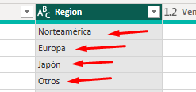

Otra columna que vamos a modificar es la columna **"Año"**. En este caso, esta columna es de tipo numérico y lo voy a transformar en tipo **"Texto"** para que **Power BI** no me lo sume o para que sea más descriptivo de alguna manera. 

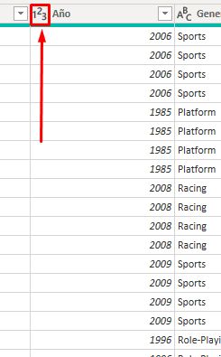 

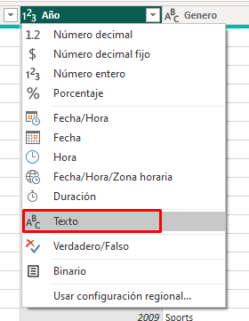 

Una vez hechas todas las transformaciones necesarias para poder trabajar, vamos a cerrar y aplicar las modificaciones. 

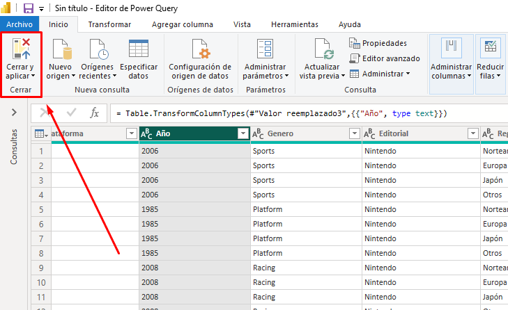 

Estas transformaciones que realizamos no modifican el archivo fuente, es decir, el dataset que hemos exportado. Ahora podemos empezar a hacer algunas visualizaciones.

