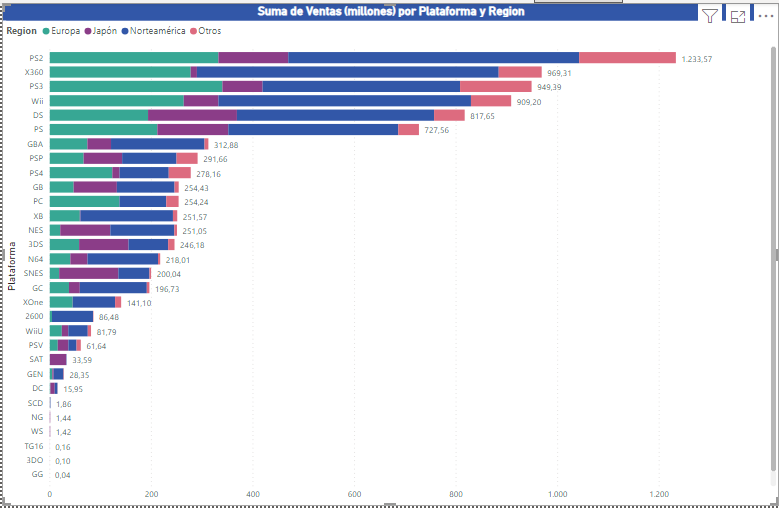

# Informe de Análisis de Datos - Ventas de Videojuegos
## Introducción

Este informe presenta un análisis detallado de un conjunto de datos que abarca las ventas de videojuegos a lo largo de varios años y en diversas plataformas. La información proporcionada ofrece una visión general del rendimiento de los juegos en términos de ventas globales, permitiendo identificar tendencias, patrones y oportunidades en la industria.

## Exploración General:

El conjunto de datos incluye información sobre videojuegos lanzados en un período que abarca desde el año 1980 hasta el año 2017.

### Plataformas:

En el vasto universo de la industria de los videojuegos, donde cada plataforma es como un reino con su propia historia, cuatro gigantes emergen como titanes inquebrantables, forjando su legado en la historia de los juegos electrónicos.

En este cuento, PlayStation 2 y 3 se alzan como las joyas de la corona del reino de Sony. Con su vasta biblioteca de juegos y su dominio en el mercado, estas plataformas han tejido historias épicas a lo largo de los años, cautivando a jugadores de todas las edades y géneros.

Xbox 360, el caballero valiente de Microsoft, ha demostrado ser una fuerza imparable en la batalla por la supremacía de los videojuegos. Su destreza en términos de cantidad de juegos y ventas globales lo ha convertido en un protagonista clave en esta odisea interactiva.

Mientras tanto, en el rincón más encantador del reino, encontramos a Nintendo Wii, la plataforma que ha llevado la magia de los videojuegos a nuevas alturas. Con su enfoque innovador y único, ha cautivado corazones y mentes, asegurándose un lugar especial en la historia de los videojuegos.

Así, en este relato, PlayStation 2 y 3, Xbox 360 y Nintendo Wii se erigen como pilares de la industria, cada uno contribuyendo con su propia leyenda a la epopeya continua de los videojuegos.

### Géneros:

En el vasto lienzo de la narrativa de los videojuegos, los géneros dan vida a historias distintas, cada uno tejiendo su propio hilo en el tapiz del entretenimiento interactivo.

En el corazón de esta historia, el ***género de acción*** emerge como el héroe valiente, con su intrépida narrativa y emocionantes desafíos. Desde épicas batallas hasta misiones cargadas de adrenalina, los juegos de acción se han ganado el corazón de jugadores de todos los rincones del mundo.

A su lado, el ***género de deportes (sports)*** se convierte en el campo de juego donde se libran competiciones emocionantes. Con eventos que van desde el fútbol hasta las carreras, los juegos de deportes se erigen como el coliseo moderno donde los jugadores pueden experimentar la emoción de la competencia en la palma de sus manos.

Y, entre sombras y estrategias, los juegos de ***disparos (shooter)*** dan un giro emocionante a la narrativa. Con sus paisajes intensos y emocionantes combates, este género lleva a los jugadores a mundos donde la destreza y la precisión son las llaves para la victoria.

Desde los primeros días de los videojuegos, donde los píxeles narraban historias simples, hasta la era actual, donde la realidad virtual se entrelaza con la imaginación, las tendencias en los géneros han sido como capítulos cambiantes en un libro épico.

Así, en esta travesía a través de los géneros y las eras, cada página escrita por la preferencia humana se convierte en una parte integral de la crónica interactiva, donde los juegos de acción, deportes y disparos dejan su marca en la historia en constante evolución de los videojuegos.

### Tendencias a lo largo de los años:

En el fluir del tiempo, las páginas de la historia de los videojuegos han revelado una narrativa fascinante. Una tendencia constante se ha esbozado en el horizonte digital: el crecimiento imparable de la cantidad de juegos lanzados. Como las estaciones cambiantes, cada año ha aportado su propia contribución a esta trama en evolución.

En la danza del progreso, los años se suceden, pero es en el año 2008 donde la sinfonía de lanzamientos alcanza su apogeo. Un crescendo de creatividad y emoción se despliega, marcando un hito en la historia de los videojuegos. Este año se erige como el culmen de una tendencia que ha llevado la industria a nuevas alturas, dejando una huella indeleble en el lienzo de la evolución de los juegos

### Análisis por Región

En el emocionante mundo de las ventas de videojuegos, cada región es un capítulo fascinante en la narrativa financiera.

En este cuento, Norteamérica se alza como la tierra de las oportunidades, donde las cifras de ventas resplandecen como estrellas en el firmamento empresarial. Con estrategias audaces y un mercado ávido de innovación, esta región lidera el camino hacia el éxito financiero.

Europa, un territorio de diversidad, contribuye al relato con su propia sinfonía de oportunidades. Las cifras de ventas, aunque ligeramente eclipsadas por Norteamérica, pintan un panorama de mercados ricos y prometedores.

En el oriente lejano, Japón añade un giro único a la trama. Aquí, la innovación y la tecnología dan forma a un mercado dinámico, creando oportunidades únicas para aquellos que buscan conquistar nuevas fronteras.

Cada región, con sus características distintivas, presenta oportunidades emocionantes para los estrategas empresariales..

### Juegos Destacados
**Top 3 Juegos**:

En el universo vibrante de los juegos destacados, tres títulos se elevan como estrellas fulgurantes, cada uno llevando consigo su propia leyenda en el firmamento de la cultura de los videojuegos.

En el podio, **"Wii Sports"** se coloca como el campeón indiscutible, un juego que trasciende las consolas y se convierte en un fenómeno cultural. Con su enfoque en la diversión y la accesibilidad, este juego ha logrado unir a jugadores de todas las edades, llevando la experiencia de juego a nuevos horizontes.

Justo detrás, **"Grand Theft Auto V"** emerge como un titán del mundo virtual. Con su narrativa cautivadora y un vasto mundo abierto, este juego ha redefinido los límites de la inmersión en el juego, transportando a los jugadores a una experiencia digital envolvente.

Y en el tercer lugar, el clásico intemporal **"Super Mario Bros"** sigue dejando su huella. Este ícono de la cultura de los videojuegos ha sido el catalizador de aventuras épicas, llevando a generaciones enteras a través de mundos mágicos y desafíos emocionantes.

Cada uno de estos juegos, un hito en la historia de los videojuegos, contribuye a la narrativa rica y en constante evolución de este medio. ¿Cuál de estos juegos ha dejado una marca indeleble en tu propia experiencia de juego? ¡La historia de los juegos destacados continúa, con nuevas aventuras y descubrimientos en cada partida!

## Conclusión

Este análisis nos llevó a través de décadas y plataformas, revelando historias de éxito en ventas, tendencias marcadas y plataformas que han forjado su legado. Desde los titanes como PlayStation y Xbox hasta géneros que evolucionaron con el tiempo, y regiones como Norteamérica liderando el camino, cada dato contó una parte crucial de la narrativa de los videojuegos. Los juegos destacados, como "Wii Sports," "Grand Theft Auto V," y "Super Mario Bros," brillan como estrellas en esta epopeya digital, recordándonos que en cada partida se esconde una nueva historia por descubrir. ¡Que siga la partida en el fascinante universo de los videojuegos!

